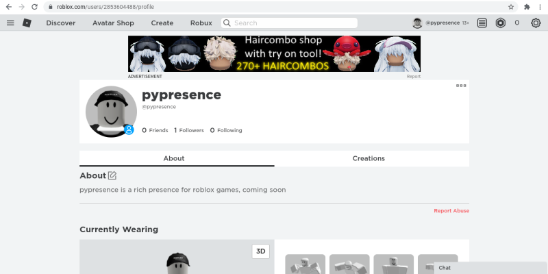
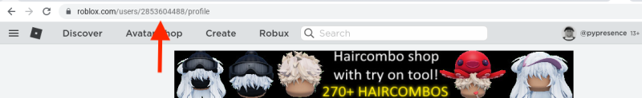

<h1>How do I get my roblox ID</h1>
Please navigate to your profile page, it will look something like this:

 
Your roblox user ID is located in the address bar, simply copy and paste this into the terminal

